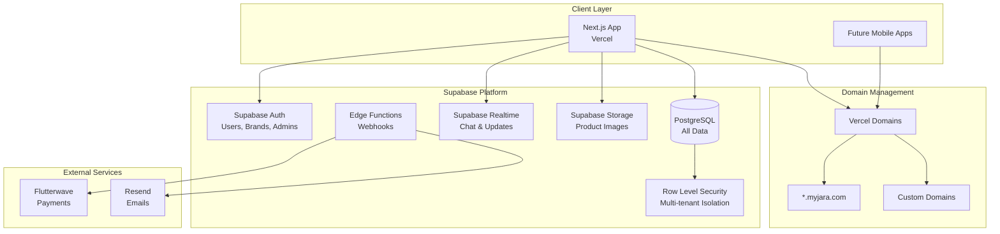
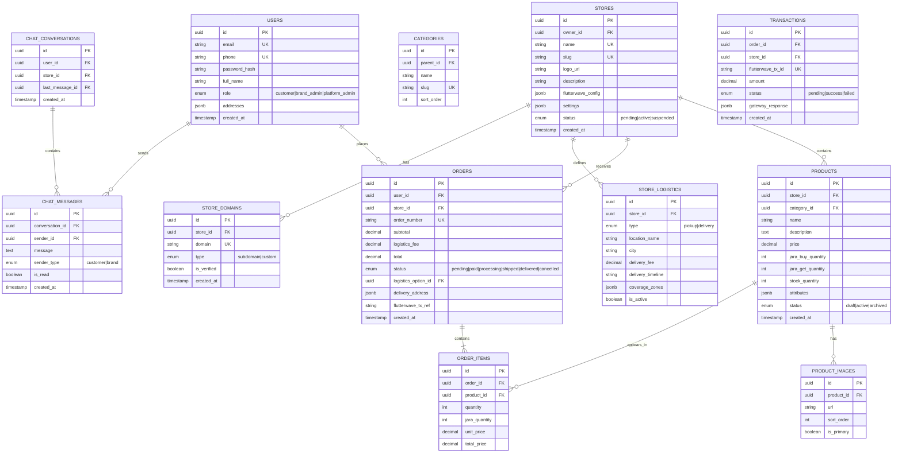

# MyJara E-Marketplace Architecture & Design Plan

A comprehensive architecture for a multi-tenant "store-of-stores" e-marketplace where brands operate independent storefronts within a unified platform.

---

## Executive Summary

MyJara is a **product-centric marketplace** where:
- Each brand has an independent, isolated store
- Products are discovered across all stores via unified search
- Jara (bonus products) is the core value proposition—not discounts
- Payments flow through Flutterwave with per-store configurations

---

## 1. System Architecture

### High-Level Architecture Diagram



### Why This Stack is Maintainable

| Benefit | How |
|---------|-----|
| **Single Codebase** | One Next.js app handles everything—no microservices |
| **Built-in Auth** | Supabase Auth with RLS = no custom auth code |
| **Type Safety** | Supabase generates TypeScript types from DB |
| **Real-time Free** | Supabase Realtime for chat—no Redis needed |
| **Serverless** | Vercel + Supabase = zero server management |
| **Easy Onboarding** | New devs learn one framework, one platform |

### Multi-Tenant Strategy

| Aspect | Approach |
|--------|----------|
| **Database** | Single Supabase project, tenant isolation via `store_id` |
| **Security** | Supabase Row Level Security (RLS) policies |
| **Domain Routing** | Vercel wildcard domains + middleware |
| **Configuration** | Per-store settings in `stores` table |

---

## 2. Database Schema

### Entity Relationship Diagram



### Key Tables Summary

| Table | Purpose |
|-------|---------|
| `users` | All users (customers, brand admins, platform admins) |
| `stores` | Brand storefronts with Flutterwave configs |
| `store_domains` | Subdomain and custom domain mappings |
| `products` | Product catalog with Jara offers |
| `store_logistics` | Pickup points and delivery zones per store |
| `orders` | Order records linking user, store, and logistics |
| `transactions` | Flutterwave payment tracking |
| `chat_*` | Brand-to-customer communication |

---

## 3. API Design

### API Structure Overview

```
/api/v1/
├── auth/
│   ├── POST   /register           # Customer registration
│   ├── POST   /login              # Login (all user types)
│   ├── POST   /logout             # Logout
│   └── POST   /refresh            # Token refresh
│
├── search/
│   └── GET    /products           # Global product search
│
├── products/
│   ├── GET    /:id                # Product detail
│   └── GET    /:id/logistics      # Product logistics options
│
├── orders/
│   ├── POST   /                   # Create order
│   ├── GET    /:id                # Order detail
│   └── GET    /my                 # User's orders
│
├── payments/
│   ├── POST   /initialize         # Get Flutterwave payment link
│   └── POST   /webhook            # Flutterwave callback
│
├── chat/
│   ├── GET    /conversations      # User's conversations
│   ├── GET    /conversations/:id  # Conversation messages
│   └── POST   /conversations/:id  # Send message
│
├── stores/
│   └── GET    /:slug              # Store public info (for subdomain)
│
├── brand/                         # Brand Dashboard APIs
│   ├── GET    /dashboard          # Dashboard stats
│   ├── CRUD   /products           # Manage products
│   ├── CRUD   /logistics          # Manage logistics
│   ├── GET    /orders             # Store orders
│   ├── GET    /chat               # Customer chats
│   ├── GET    /support            # Support admin view
│   └── GET    /operations         # Operations admin view
│
└── admin/                         # Platform Admin APIs
    ├── CRUD   /stores             # Manage stores
    ├── CRUD   /categories         # Manage categories
    ├── GET    /transactions       # All transactions
    └── GET    /analytics          # Platform analytics
```

---

## 4. UI Layouts

### 4.1 Homepage / Discover
- **Hero**: Unified search for products across all brands.
- **Filters**: City, Price, and specifically "Min Jara" (bonus gift) filters.
- **Featured**: Highlighting the best Jara offers in Nigeria.

### 4.2 Checkout Flow
- **Quantity Selector**: Dynamically calculates the free "Jara" items.
- **Logistics**: Brands define their own pickup points and delivery zones.
- **Payment**: Seamless Flutterwave integration.

### 4.3 Brand Operations
- **Logistics Center**: Manage multiple pickup locations and delivery fees.
- **Order Fulfillment**: Detailed tracking from payment to delivery.
- **Customer Support**: Real-time chat with search context.

---

## 5. Technical Stack

| Layer | Technology |
|-------|------------|
| **Frontend** | Next.js 16 (App Router) |
| **Styling** | Tailwind CSS + shadcn/ui |
| **Database** | Supabase (PostgreSQL) |
| **Auth** | Supabase Auth (RLS Isolation) |
| **Real-time** | Supabase Realtime (Chat) |
| **Payments** | Flutterwave |
| **Email** | Resend |

---

## 6. Implementation Phases

### Phase 1: Foundation ✅
- Next.js + Supabase project setup
- Multi-tenant database schema & RLS policies
- Core UI component library

### Phase 2: Core Marketplace ✅
- Product management & Jara configuration
- Global search engine
- Brand registration & dashboard foundation

### Phase 3: Transactions ✅
- Checkout flow & logistics selection
- Flutterwave payment integration
- Order management backend

### Phase 4: Communication & Operations ✅
- Real-time chat system
- Store customization (Theme/Layout)
- Automated email notifications (Resend)
- Backend Payment Webhooks

---

## Getting Started

1. Clone the repository
2. Install dependencies: `npm install`
3. Set up environment variables in `.env.local`
4. Run development server: `npm run dev`
